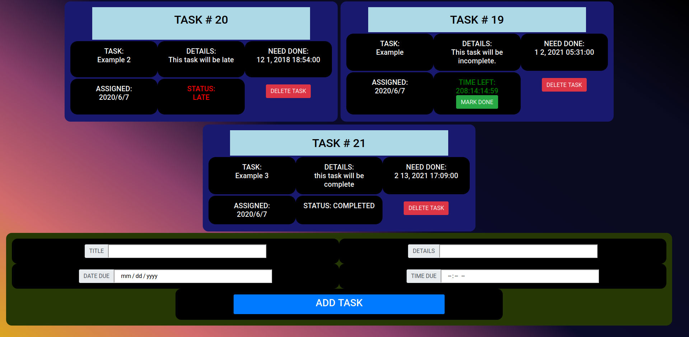

# SQL To Do List

## Intro

This project is going to be a simple to do list with database support. It will be responsive to window size, and if done right, should include all logical features for a To Do List app, while being straightforward for the end user.


## linking to postgres

adjust the `pool.js` file in `server/modules` to fit your username and password for whatever postgres tool you use.

## Setting Up/ Creating your database.

You can name your database whatever you'd like to, but you'll need to change the database value in `pool.js` if you don't name it **To Do List**.
when you're finished setting the database up, you need to set the table up. Create a table with the name of **list_items** in your new database, with the following values **NOTE: if you do not name your table `list_items`, you will need to rewrite much of the project to be compatible with your table.**

```sql
CREATE TABLE list_items (
id serial primary key,
title varchar(50) NOT NULL,
description varchar(200),
done_by_date DATE NOT NULL,
done_by_time TIME,
added DATE NOT NULL)
```

## Adding Necessary Dependecies

To run the app for the first time, you'll need to go to this file in a bash terminal, and type the commands

```bash
npm init --yes
npm install express
npm install pg
npm install moment
```

**This will not install anything to your computer. only the project.**

## You're Ready To Start ! :)

```bash
npm start
```
